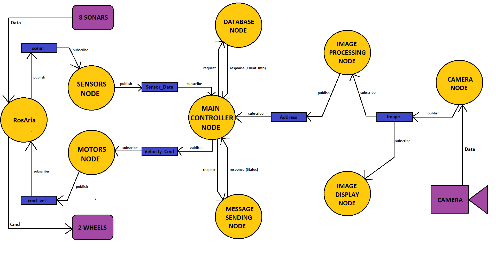

# Проект по предметот Роботика

## Содржина
- [Опис на идејата](https://github.com/ekostadinov5/robotika_proekt#%D0%BE%D0%BF%D0%B8%D1%81-%D0%BD%D0%B0-%D0%B8%D0%B4%D0%B5%D1%98%D0%B0%D1%82%D0%B0)
- [Опис на системот](https://github.com/ekostadinov5/robotika_proekt#%D0%BE%D0%BF%D0%B8%D1%81-%D0%BD%D0%B0-%D1%81%D0%B8%D1%81%D1%82%D0%B5%D0%BC%D0%BE%D1%82)
- [Програмирање и интеграција на јазлите](https://github.com/ekostadinov5/robotika_proekt#%D0%BF%D1%80%D0%BE%D0%B3%D1%80%D0%B0%D0%BC%D0%B8%D1%80%D0%B0%D1%9A%D0%B5-%D0%B8-%D0%B8%D0%BD%D1%82%D0%B5%D0%B3%D1%80%D0%B0%D1%86%D0%B8%D1%98%D0%B0-%D0%BD%D0%B0-%D1%98%D0%B0%D0%B7%D0%BB%D0%B8%D1%82%D0%B5)
- [Инсталација, конфигурирање и стартување](https://github.com/ekostadinov5/robotika_proekt#%D0%B8%D0%BD%D1%81%D1%82%D0%B0%D0%BB%D0%B0%D1%86%D0%B8%D1%98%D0%B0-%D0%BA%D0%BE%D0%BD%D1%84%D0%B8%D0%B3%D1%83%D1%80%D0%B8%D1%80%D0%B0%D1%9A%D0%B5-%D0%B8-%D1%81%D1%82%D0%B0%D1%80%D1%82%D1%83%D0%B2%D0%B0%D1%9A%D0%B5)
- [Тестирање на системот](https://github.com/ekostadinov5/robotika_proekt#%D1%82%D0%B5%D1%81%D1%82%D0%B8%D1%80%D0%B0%D1%9A%D0%B5-%D0%BD%D0%B0-%D1%81%D0%B8%D1%81%D1%82%D0%B5%D0%BC%D0%BE%D1%82)
- [Помошни материјали, пакети, библиотеки и модели](https://github.com/ekostadinov5/robotika_proekt#%D0%BF%D0%BE%D0%BC%D0%BE%D1%88%D0%BD%D0%B8-%D0%BC%D0%B0%D1%82%D0%B5%D1%80%D0%B8%D1%98%D0%B0%D0%BB%D0%B8-%D0%BF%D0%B0%D0%BA%D0%B5%D1%82%D0%B8-%D0%B1%D0%B8%D0%B1%D0%BB%D0%B8%D0%BE%D1%82%D0%B5%D0%BA%D0%B8-%D0%B8-%D0%BC%D0%BE%D0%B4%D0%B5%D0%BB%D0%B8)
- [Изработиле](https://github.com/ekostadinov5/robotika_proekt#%D0%B8%D0%B7%D1%80%D0%B0%D0%B1%D0%BE%D1%82%D0%B8%D0%BB%D0%B5)

## Опис на идејата

Нашата идеја за проектот беше да направиме еден вид на робот поштар(доставувач) користејќи возилен робот P3-DX од MobileRobots. Кога ќе добие наредба за достава до некое специфично место/а, роботот почнува да се движи по дадена предефинирана патека и во исто време, преку камера ги анализира таблите за улица и број. Ако наиде на совпаѓање со некоја од адресите кои што ги добил на влез, тогаш застанува на тоа место и праќа известување дека е на соодветната локација. После одредено време продолжува кон следната локација.

## Опис на системот

Системот, од аспект на хардверски целини, се состои од два дела, возилниот робот P3-DX и лаптоп. Роботот на себе има 8 сонари, преку кои може да ја мери оддалеченоста од дадена препрека, и дополнително има два серво мотори преку кои ги придвижува тркалата. Лаптопот има камера, преку која се врши снимањето. 

Од аспект на логички дизајн, системот се состои од 9 јазли/процеси кои се извршуваат истовремено и се во постојана меѓусебна интеракција. Овие јазли може да се поделат во две групи, и тоа една која е задолжена за движење на роботот и една која е задолжена за процесирање на сликите. Дополнително, два од јазлите претставуваат сервиси за комуникација со базата на податоци и испраќање на пораки на корисниците. На следната слика е прикажан дијаграмот на системот:



## Програмирање и интеграција на јазлите

Следи краток опис на функционалностите и поврзаноста на секој од јазлите. Дополнително, порелевантните сегменти од кодот на јазлите се објаснети со коментари во самите скрипти. 

#### 1. main_controller_node

Главниот јазол на системот. Тој е претплатен на топикот *sensor_data* преку кој добива сензорски податоци од *sensors_node* јазолот и врз основа на нив донесува соодветна одлука за тоа дали и како ќе се придвижи роботот. За придвижување на роботот, овој јазол publish-нува податоци на топикот *velocity_cmd*. Дополнително, јазолот е претплатен и на топикот *address* преку кој добива податоци за адреса, доколку постои таква која е препознаена од страна на *image_proccesing_node*. Кога ќе добие податок за дадена адреса, истиот испраќа барање до јазолот *database_node* и како одговор ги добива податоците за соодветниот клиент кој живее на дадената адреса, доколку таков постои. Потоа, овие информации за клиентот ги користи за да испрати барање до јазолот *message_sending_node*, за да се испрати порака до соодветниот клиент дека неговата пратка пристигнала.

#### 2. sensors_node

Добива информации од топикот */RosAria/sonar* за сензорските отчитувања на роботот и пресметува оддалеченост до дадена препрека, или повеќе ако ги има. Прави проверка користејќи ги двата предни сензори за тоа дали има препрека пред него, а потоа користејќи ги страничните сензори проверува дали има некаква препрека од страните и според тоа publish-нува информации на топикот *sensor_data*.

#### 3. motors_node

Добива информации од топикот *velocity_cmd* во форма на string и информациите за придвижувањето ги праќа на топикот */RosAria/cmd_vel*. 

#### 4. database_node

Претставува сервисен јазол кој се користи за комуникација со базата на податоци. Сервисот кој го нуди е со име *database_service*.

#### 5. message_sending_node

Претставува сервисен јазол кој што се користи за испраќање на порака на корисникот дека е пристигната пратката. Сервисот кој го нуди е со име *message_sending_service*.

#### 6. image_processing_node

Овој јазол е одговорен за обработка на сликите (frames) кои се добиваат од камерата преку топикот *image* и извлекување на текст од истите. Алгоритамот се применува врз секоја десетта слика (frame) добиена од камерата, поради неговото долго време на извршување. Најпрвин се детектираат регионите од сликата кои што содржат некаков текст. Секој од овие региони, кои се во форма на правоаголник, се проширува со по десет пиксели во сите правци. Потоа, секој од регионите се конвертира во Grayscale формат и се изострува. Изострувањето се прави на начин што добиениот регион се измазнува со користење на Гаусов филтер, по што резултатот од измазнувањето се одзема од оригиналниот регион. Целта на изострувањето е да се добие регион (слика) во кој текстот би можел полесно да се испарсира. Следен чекор е парсирањето на текстот од регионот во соодветен *string*. Откако текстот ќе се испарсира, од него се отстрануваат евентуалните непосакувани карактери, по што тој се праќа како порака на топикот *address*. 

#### 7. camera_node

Претставува јазол кој што е директно поврзан со камерата, постојано зема слики, и истите ги publish-нува на топикот со име *image*.

#### 8. image_display_node

Овој јазол го зема видеото од топикот *image* и го прикажува.

#### 9. RosAria

Екстерен јазол, кој не е дел од самиот пакет (и чиј пакет треба дополнително да се инсталира), а се користи за комуникација со сензорите и моторите на роботот, односно за читање на сензорските податоци и давање на команди на моторите за придвижување. 

## Инсталација, конфигурирање и стартување

1. Отворете го терминалот.

2. Клонирајте го проектот во *src* директориумот од вашата работна околина:

```
cd ~/catkin_ws/src
git clone https://github.com/ekostadinov5/robotika_proekt.git
```

3. Клонирајте го [ROSARIA](http://wiki.ros.org/ROSARIA) пакетот во *src* директориумот од вашата ROS работна околина:

```
cd ~/catkin_ws/src
git clone https://github.com/amor-ros-pkg/rosaria.git
```

4. Инсталирајте ја ARIA библиотеката. Истата можете да ја спуштите од [ТУКА](https://web.archive.org/web/20180213095203/http:/robots.mobilerobots.com/wiki/ARIA).

5. Искомпајлирајте ги проектите:

```
cd ~/catkin_ws
catkin_make
```

6. Инсталирајте го [Tesseract OCR](https://github.com/tesseract-ocr/tesseract) пакетот:

```
sudo apt install tesseract-ocr
```

7. Инсталирајте ги потребните Python пакети:

```
cd ~/catkin_ws/src/robotika_proekt
pip install -r requirements.txt
```

8. Подесете ја патеката до EAST текст детекторот. Промената треба да се изврши во скриптата *image_processing_node.py* која се наоѓа во *src* директориумот на проектот, на линија 21.

**ЗАБЕЛЕШКА:** EAST текст детекторот е зачуван во *models* директориумот на проектот, под името *frozen_east_text_detection.pb*. Функцијата која го вчутува (`cv2.dnn.readNet(path)`) на влез побарува АПСОЛУТНА патека до истиот, па затоа е потребно да се изврши соодветното подесување. Новата патека ќе биде од обликот: *path_to_project/models/frozen_east_text_detection.pb*

9. Вклучете го роботот и поврзете се со него преку сериска врска. 

10. Доколку не ви е автоматски подесено, source-нете ја catkin setup скриптата во работниот простор:
```
cd ~/catkin_ws
. devel/setup.bash
```

11. Стартувајте ги јазлите:

```
sudo chmod 777 -R /dev/ttyUSB0
roslaunch robotika_proekt system.launch
```

## Тестирање на системот

Тест возењето беше изведено на пат со три кривини и три можни локации за застанување. Состојбата во базата на податоци при изведбата на тестот беше следната:

```
db = [
    {
        "id": 1,
        "name": "John",
        "surname": "Smith",
        "address": "adresabr1",
        "to_deliver": True
    },
    {
        "id": 2,
        "name": "Peter",
        "surname": "Johnson",
        "address": "adresabr2",
        "to_deliver": True
    },
    {
        "id": 3,
        "name": "Forest",
        "surname": "Gump",
        "address": "adresabr3",
        "to_deliver": True
    }
]
```

Според ова, роботот треба да достави пратка до секоја од трите локации на патот, бидејќи *to_deliver* својството е поставено на *True* кај трите *Client* објекти. Следи видео на кое е прикажана изведбата на тест возењето:

<a href="http://www.youtube.com/watch?feature=player_embedded&v=ZBhcWPW9jIc" 
target="_blank"></a>

## Помошни материјали, пакети, библиотеки и модели

- [Pioneer 3 Operations Manual](https://www.inf.ufrgs.br/~prestes/Courses/Robotics/manual_pioneer.pdf)
- [pytesseract](https://pypi.org/project/pytesseract/)
- [Tesseract OCR](https://github.com/tesseract-ocr/tesseract)
- [ROSARIA](http://wiki.ros.org/ROSARIA)
- [ARIA](https://web.archive.org/web/20180213095203/http:/robots.mobilerobots.com/wiki/ARIA)
- [MobileSim](https://web.archive.org/web/20180205220201/http://robots.mobilerobots.com/wiki/MobileSim)
- [EAST: An Efficient and Accurate Scene Text Detector](https://arxiv.org/pdf/1704.03155.pdf)
- [OpenCV Text Detection (EAST text detector)](https://www.pyimagesearch.com/2018/08/20/opencv-text-detection-east-text-detector/)
- [frozen_east_text_detection](https://www.kaggle.com/yelmurat/frozen-east-text-detection/data#)

## Изработиле
- Антонија Велкоска
- Евгениј Костадинов

